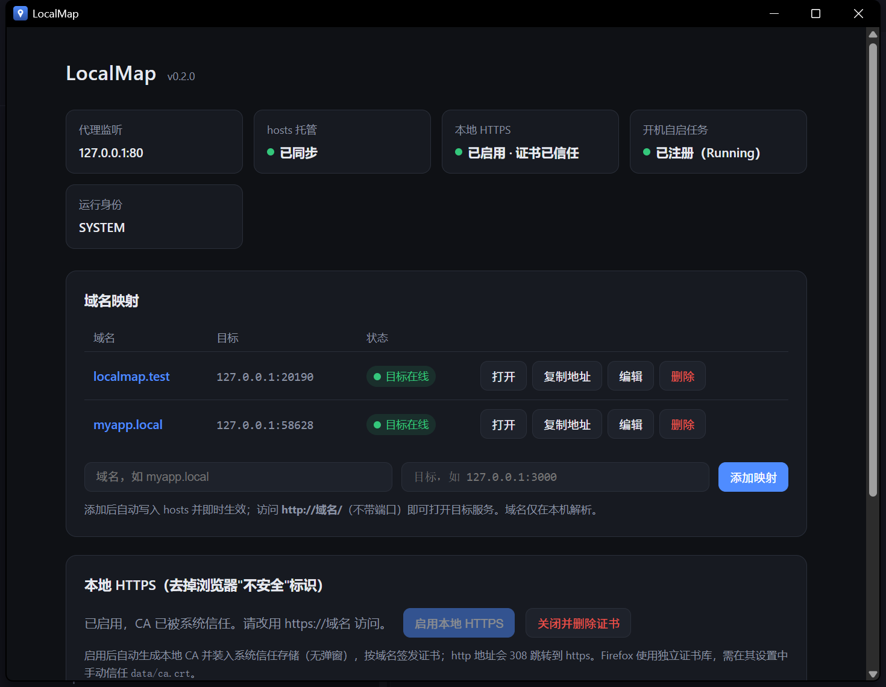

# LocalMap

本地域名映射管理工具（Windows）：把 `127.0.0.1:端口` 映射为易记域名（如 `myapp.local`），
浏览器直接访问 `http://域名/` 即可，无需记端口。带桌面 GUI，不再是黑盒。



## 组成

```
localmap/
├── engine/            # 引擎源码（Go，单文件 exe，零依赖）
│   ├── main.go        # 入口：启动反代 + 控制 API，开机同步 hosts
│   ├── store.go       # 映射表（data/mappings.json）
│   ├── hostsfile.go   # hosts 受管区块读写（>>> LOCALMAP <<< 标记之间）
│   ├── proxy.go       # 反向代理：Host 路由、Host 改写、WebSocket/SSE 透传、http→https 308 跳转
│   ├── cert.go        # 本地 CA（ECDSA P-256，10 年）+ 按域名懒签发叶子证书（2 年，缓存 data/certs/）
│   ├── task_windows.go# 计划任务 LocalMapEngine 注册/删除/状态
│   ├── api.go         # 控制 API（token 鉴权）+ 内嵌管理界面
│   └── admin.html     # 管理界面（vanilla JS，go:embed）
├── ui-tauri/          # 桌面壳源码（Tauri v2，窗口加载 http://127.0.0.1:20190/）
├── app/               # 发布产物
│   ├── localmap.exe        # 桌面 app（双击即用）
│   ├── localmap-engine.exe # 引擎（计划任务 LocalMapEngine 以 SYSTEM 运行）
│   └── data/               # mappings.json + token（控制 API 凭证）+ ca.crt/ca.key + certs/（HTTPS 启用后）
└── scripts/           # make-shortcut.ps1 等辅助脚本
```

## 架构

- **引擎**（`localmap-engine.exe`）：常驻后台。监听 `127.0.0.1:80` 做反向代理，
  按 Host 头路由到映射目标；监听 `127.0.0.1:20190` 提供控制 API 和管理界面。
  增删映射时自动同步 hosts 受管区块并即时生效，无需重启任何东西。
- **计划任务 `LocalMapEngine`**：开机以 SYSTEM 身份运行引擎（无窗口）。
  只有绑定 80 端口和写 hosts 需要特权，全部收敛在引擎里；桌面 app 本身不需要管理员。
- **桌面 app**（`localmap.exe`）：Tauri 壳，加载引擎的管理界面；
  引擎未运行时会尝试拉起同目录的引擎。

## 使用

- 打开桌面 app（桌面快捷方式 LocalMap），或浏览器访问 `http://localmap.test/`（等价界面）
- 添加映射：域名 + 目标（`host:port`），立即生效
- 开机自启的注册/删除在 app 内一键完成

注意：目标服务若做了 Host 校验 / DNS-rebinding 防护（部分本地 Web 服务默认开启），引擎会把 Host 头
改写为目标地址，天然兼容。同理，浏览器 WebSocket/REST 请求携带的 Origin 头，
仅当它与映射域名一致时才会改写为目标源（第三方站点的跨域 Origin 原样转发，
仍会被目标服务拒绝，防护不减弱）。目标服务若有登录凭证（localStorage 按域名隔离），
首次用新域名访问时可能需要重新走一次该应用自己的登录/引导流程。

## 本地 HTTPS（去掉"不安全"标识）

在 app 里点"启用本地 HTTPS"即可，一键完成：

- 引擎生成自签 CA（ECDSA P-256，10 年，存 `data/ca.crt` / `data/ca.key`），
  以 SYSTEM 身份 `certutil -addstore root` 装入系统受信任根存储（无弹窗）；
- 每个映射域名按需签发叶子证书（2 年，SAN=域名，缓存 `data/certs/`）；
- 引擎在 `127.0.0.1:443` 做 TLS 终止（SNI 路由），与 80 端口共用同一代理逻辑；
- 启用后 http 地址一律 308 跳转到 https，浏览器地址栏不再显示"不安全"。

引擎重启后自动恢复 HTTPS（检测到 `data/ca.crt` 即重新监听 443）。

在 app 里点"关闭并删除证书"可完整回滚：停 443 监听、从系统信任存储删除 CA、
删除 `data/ca.crt` / `ca.key` / `certs/`，http 访问恢复原样。

注意：

- **Firefox 使用独立证书库**，不信任系统根存储；需在 设置 → 证书 → 导入 中手动信任
  `data/ca.crt`。Chrome/Edge/系统其他组件无需任何操作。
- `https://域名` 与 `http://域名` 是不同的 origin，目标服务的 localStorage 凭证
  （如某些本地服务的访问 token）需在 https 地址下重新走一次引导/登录。
- 命令行用 Git Bash 自带的 curl（OpenSSL）测 https 会不信任系统证书库，
  请用 Windows 自带 `curl.exe`（Schannel）验证，或加 `--ssl-no-revoke`
  （Schannel 对无 CRL 的自签 CA 默认严格检查吊销，浏览器为软失败不受影响）。

## 开发

```bash
# 引擎
cd engine && go build -o ../bin/localmap-engine.exe .
../bin/localmap-engine.exe -proxy-addr 127.0.0.1:18080 -api-addr 127.0.0.1:20190 -data ../data

# 桌面壳
cd ui-tauri && npm install && npm run dev      # 开发
npm run build                                  # release exe（--no-bundle）
```

引擎 CLI：`-install` / `-uninstall` 注册或删除开机自启计划任务（需管理员）。
